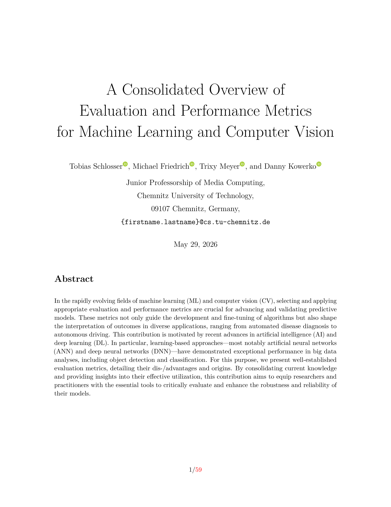

A Consolidated Overview of Evaluation and Performance Metrics for Machine Learning and Computer Vision
======================================================================================================


By Tobias Schlosser, Michael Friedrich, Trixy Meyer, and Danny Kowerko


---

In the rapidly evolving fields of machine learning (ML) and computer vision (CV), selecting and applying appropriate evaluation and performance metrics are crucial for advancing and validating predictive models. These metrics not only guide the development and fine-tuning of algorithms but also shape the interpretation of outcomes in diverse applications, ranging from automated disease diagnosis to autonomous driving. This contribution is motivated by recent advances in artificial intelligence (AI) and deep learning (DL). In particular, learning-based approaches—most notably artificial neural networks (ANN) and deep neural networks (DNN)—have demonstrated exceptional performance in big data analyses, including object detection and classification. For this purpose, we present well-established evaluation metrics, detailing their dis-/advantages and origins. By consolidating current knowledge and providing insights into their effective utilization, this contribution aims to equip researchers and practitioners with the essential tools to critically evaluate and enhance the robustness and reliability of their models.

---


Please cite the paper in your publications if it helps your research:

```
@article{SFMK2024,
  title={A Consolidated Overview of Evaluation and Performance Metrics for Machine Learning and Computer Vision},
  author={Schlosser, Tobias and Friedrich, Michael and Meyer, Trixy and Kowerko, Danny},
  year={2024}
}
```


Compilation
-----------

```
make clean && make
```


Example
-------



