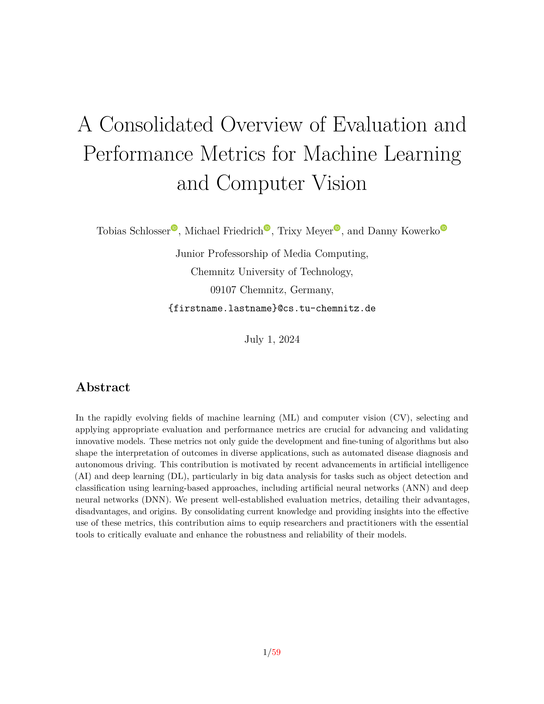

A Consolidated Overview of Evaluation and Performance Metrics for Machine Learning and Computer Vision
======================================================================================================


By Tobias Schlosser, Michael Friedrich, Trixy Meyer, and Danny Kowerko


---

Within the rapidly evolving fields of machine learning (ML) and computer vision (CV), the selection and application of appropriate evaluation and performance metrics are paramount to the advancement and validation of innovative models. These metrics not only guide the development and fine-tuning of algorithms but also shape the interpretation of outcomes in diverse applications, ranging from automated disease diagnosis to autonomous driving. This manuscript is therefore also driven by the recent advancements in artificial intelligence (AI) and deep learning (DL) with a focus on big data analysis in areas such as object detection and classification by utilizing learning-based approaches including artificial neural networks (ANN) such as deep neural networks (DNN). For this purpose, we present well-established evaluation metrics, detailing their different advantages, disadvantages, and related origins. By consolidating current knowledge and offering insights into the effective use of these metrics, the goal of this work is to equip researchers and practitioners with the essential tools to critically evaluate and enhance the robustness and reliability of their models. Since this manuscript is designed to be a living resource, it will be systematically updated to incorporate novel evaluation metrics, ensuring its continued development.

---


Please cite the paper in your publications if it helps your research:

```
@article{SFMK2024,
  title={A Consolidated Overview of Evaluation and Performance Metrics for Machine Learning and Computer Vision},
  author={Schlosser, Tobias and Friedrich, Michael and Meyer, Trixy and Kowerko, Danny},
  year={2024}
}
```


Compilation
-----------

```
make clean && make
```


Example
-------



